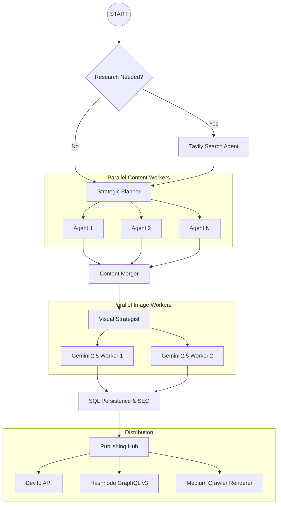

# ScribeFlow AI

A production-grade, multi-agent content engine designed to transform a single topic into a high-impact, research-backed, and visually rich blog post in minutes. ScribeFlow leverages **LangGraph** orchestration to perform deep web research, architect strategic outlines, and generate unique visual assets in parallel—featuring secure authentication, multi-platform publishing, and integrated payments.

---

## Core Capabilities
Writing a high-quality technical blog typically takes hours. ScribeFlow reduces this to **under 2 minutes** while maintaining:
*   **Agentic Orchestration:** Built on LangGraph for stateful, multi-agent collaboration between researchers, planners, and writers.
*   **Near-Zero Hallucination:** Strict grounding in real-time web data via **Tavily Search**.
*   **Multi-Platform Distribution:** Direct, live publishing to **Dev.to**, **Hashnode (v3 API)**, and an optimized crawler-friendly flow for **Medium**.
*   **Static HTML Rendering:** A dedicated backend renderer for Medium's importer to ensure perfect formatting and image resolution.
*   **Secure Authentication:** Native support for Google OAuth and Passwordless Email OTP verification.
*   **Integrated Payments:** Built-in **Razorpay** support with a unified credit-based system.
*   **Admin Dashboard:** Full system oversight including user tracking, credit management, and a global feed of generated content.
*   **Visual Engagement:** Automated generation of custom diagrams and images using **Gemini 2.5 Flash**.

---

## Architecture
The system utilizes a "Plan-Execute-Distribute" cycle powered by an asynchronous multi-agent graph.



---

## Tech Stack
*   **Backend:** FastAPI, LangGraph, SQLModel (SQLite/PostgreSQL), Gunicorn.
*   **Frontend:** React 18 (TypeScript), Tailwind CSS, Framer Motion, Lucide Icons.
*   **AI:** OpenAI (Text), Gemini 2.5 Flash (Vision), Tavily Search API.
*   **Deployment:** AWS EC2 (Gunicorn/Uvicorn), Vercel (Frontend), Let's Encrypt SSL.

---

## Quick Start

### 1. Installation
```bash
# Clone the repository
git clone https://github.com/tanishra/scribe-flow.git
cd Scribe-flow

# Setup Backend
pip install -r requirements.txt

# Setup Frontend
cd frontend-react
npm install
```

### 2. Configuration
Create a `.env` file in the root directory:
```env
# AI & Search
OPENAI_API_KEY=your_openai_key
TAVILY_API_KEY=your_tavily_key
GOOGLE_API_KEY=your_gemini_key

# Authentication
VITE_GOOGLE_CLIENT_ID=your_google_id.apps.googleusercontent.com
SECRET_KEY=your_jwt_secret_key

# Email (SMTP)
SMTP_USER=your_email@gmail.com
SMTP_PASSWORD=your_gmail_app_password
SMTP_SERVER=smtp.gmail.com
SMTP_PORT=587

# Payments
RAZORPAY_KEY_ID=your_razorpay_key
RAZORPAY_KEY_SECRET=your_razorpay_secret
```

### 3. Running Locally
**Terminal 1: Backend**
```bash
python -m uvicorn app.api:app --reload
```

**Terminal 2: Frontend**
```bash
cd frontend-react && npm run dev
```

---

## Contribution
Contributions are what make the open-source community an amazing place to learn, inspire, and create.
1. Fork the Project
2. Create your Feature Branch (`git checkout -b feature/AmazingFeature`)
3. Commit your Changes (`git commit -m 'Add some AmazingFeature'`)
4. Push to the Branch (`git push origin feature/AmazingFeature`)
5. Open a Pull Request