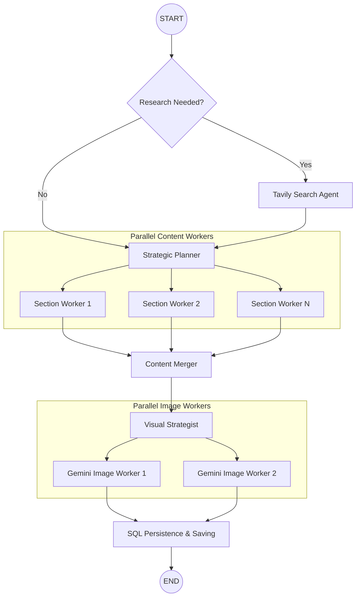

# ScribeFlow AI

A production-grade, multi-agent content engine designed to transform a single topic into a high-impact, research-backed, and visually rich blog post in minutes. ScribeFlow leverages **LangGraph** orchestration to perform deep web research, architect strategic outlines, and generate unique visual assets in parallel—now featuring secure authentication, persistent history, and integrated payments.

---

## Why It Matters
Writing a high-quality technical blog typically takes hours of research and drafting. ScribeFlow reduces this to **under 2 minutes** while maintaining:
*   **Near to Zero Hallucination:** Strict grounding in real-time web data via Tavily Search.
*   **Secure Authentication:** Native support for Google OAuth and Passwordless Email OTP verification.
*   **Integrated Payments:** Built-in **Razorpay** support for UPI and Card payments, featuring a unified credit-based system for all users.
*   **One-Click Publishing:** Direct, live distribution to platforms like **Dev.to** with automatic canonical link protection and absolute image resolution.
*   **SEO & Brand Voice:** Automatic generation of meta descriptions and keywords, with customizable writing tones (Professional, Witty, Technical, etc.).
*   **In-App Editor:** A full-screen Markdown editor to refine AI-generated content before final distribution.
*   **Data Persistence:** SQL-backed history allows users to revisit, preview, and download previously generated blogs anytime.
*   **Visual Engagement:** Automatically generates custom diagrams and images using Gemini 2.0 Flash.

---

## Architecture
The system is built on an asynchronous multi-agent graph, utilizing a "Plan-Execute-Persist" cycle.



---

## Quick Start

### 1. Installation
1. **Fork the Repo:** Click the **Fork** button at the top right of this page to create your own copy.
2. **Clone & Setup:**
```bash
# Clone your fork
git clone https://github.com/tanishra/scribe-flow.git
cd Scribe-flow

# Setup Backend
pip install -r requirements.txt

# Setup Frontend
cd frontend-react
npm install
```

### 2. Configuration
Create a `.env` file in the root directory with the following keys:
```env
# AI Services
OPENAI_API_KEY=your_openai_key
TAVILY_API_KEY=your_tavily_key
GOOGLE_API_KEY=your_gemini_key

# Authentication
VITE_GOOGLE_CLIENT_ID=your_google_id.apps.googleusercontent.com
SECRET_KEY=your_jwt_secret_key

# Email OTP (SMTP)
SMTP_USER=your_email@gmail.com
SMTP_PASSWORD=your_gmail_app_password
SMTP_SERVER=smtp.gmail.com
SMTP_PORT=587

# Payments (Razorpay)
RAZORPAY_KEY_ID=your_razorpay_key
RAZORPAY_KEY_SECRET=your_razorpay_secret

# Database
DATABASE_URL=sqlite:///database.db # Or your Postgres URL
```

### 3. Running Locally
You need two terminal windows:

**Terminal 1: FastAPI Backend**
```bash
python -m uvicorn app.api:app --reload
```

**Terminal 2: React Frontend**
```bash
cd frontend-react
npm run dev
```

---

## Contribution
Contributions are what make the open-source community an amazing place to learn, inspire, and create.
1. Fork the Project
2. Create your Feature Branch (`git checkout -b feature/AmazingFeature`)
3. Commit your Changes (`git commit -m 'Add some AmazingFeature'`)
4. Push to the Branch (`git push origin feature/AmazingFeature`)
5. Open a Pull Request
