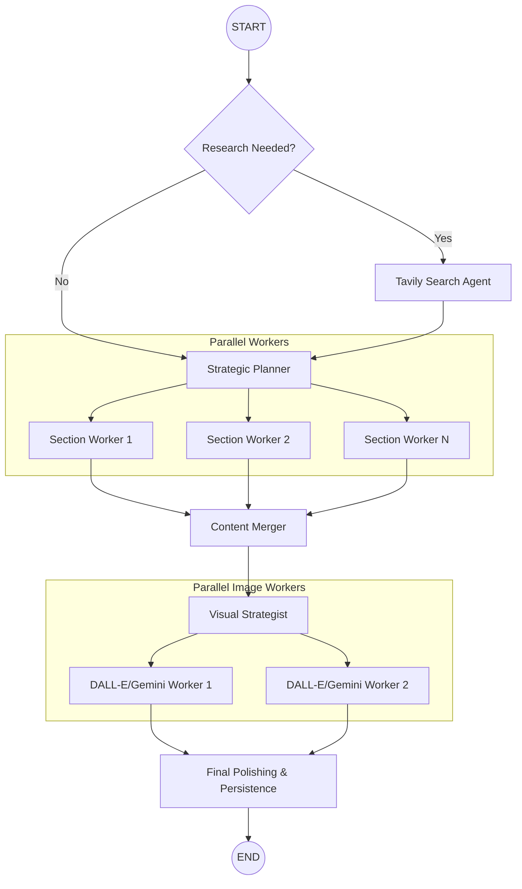

# ✍️ ScribeFlow AI

**ScribeFlow AI** is a production-grade, multi-agent content engine designed to transform a single topic into a high-impact, research-backed, and visually rich blog post in minutes. Unlike simple LLM wrappers, ScribeFlow uses an advanced **LangGraph** orchestration to perform deep web research, architect a strategic outline, and generate unique visual assets in parallel.

---

## Why It Matters
Writing a high-quality technical blog typically takes 4–8 hours of research, drafting, and asset creation. ScribeFlow reduces this to **under 2 minutes** while maintaining:
*   **Near to Zero Hallucination:** Strict grounding in real-time web data via Tavily.
*   **Technical Precision:** Native support for professional **LaTeX** math and verified code snippets.
*   **Visual Engagement:** Automatically generates custom diagrams and images using Gemini 2.5 Flash.
*   **Ready-to-Publish:** Outputs are bundled into ZIP files containing Markdown and optimized image assets.

---

## Architecture
The system is built on a "Plan-Execute-Verify" cycle using an asynchronous multi-agent graph.



---

## Quick Start

### 1. Installation
1. **Fork the Repo:** Click the **Fork** button at the top right of this page to create your own copy.
2. **Clone & Setup:**
```bash
# Clone your fork (replace YOUR_USERNAME)
git clone https://github.com/YOUR_USERNAME/ScribeFlow-AI.git
cd ScribeFlow-AI

# Setup Backend
pip install -r requirements.txt

# Setup Frontend
cd frontend-react
npm install
```

### 2. Configuration
Create a `.env` file in the root directory:
```env
OPENAI_API_KEY=your_key
TAVILY_API_KEY=your_key
GOOGLE_API_KEY=your_key
```

### 3. Running Locally
You need two terminal windows:

**Terminal 1: FastAPI Backend**
```bash
python -m app.backend
```

**Terminal 2: React Frontend**
```bash
cd frontend-react
npm run dev
```

---

## Contribution
Contributions are what make the open-source community an amazing place to learn, inspire, and create.
1. Fork the Project
2. Create your Feature Branch (`git checkout -b feature/AmazingFeature`)
3. Commit your Changes (`git commit -m 'Add some AmazingFeature'`)
4. Push to the Branch (`git push origin feature/AmazingFeature`)
5. Open a Pull Request