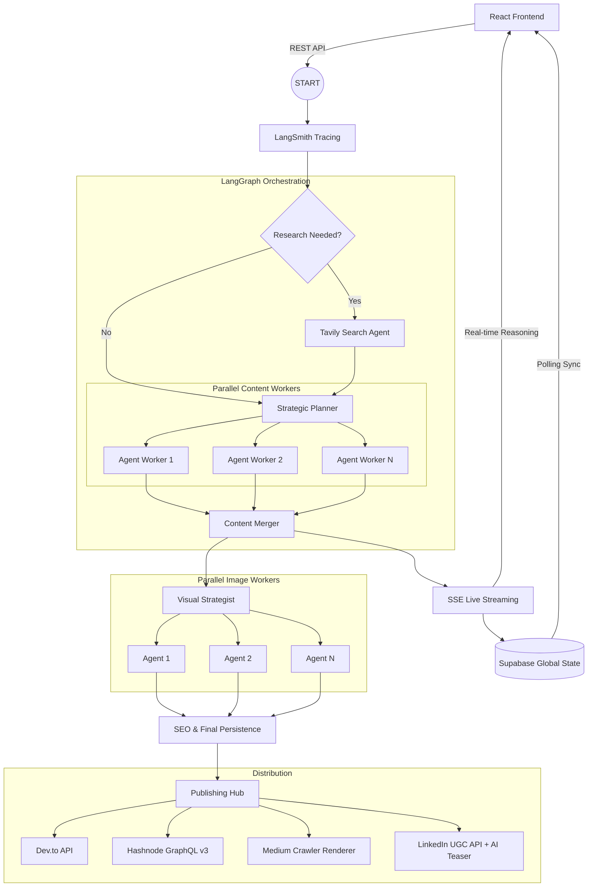

<div align="center">
  
  <p><strong>Production-grade, multi-agent content engine for high-impact blog posts.</strong></p>
  <p>AuthoGraph transforms a single topic into a research-backed, visually rich blog post in minutes using LangGraph orchestration.</p>
  <p>
    <a href="https://fastapi.tiangolo.com/" target="_blank" rel="noreferrer">
      
    </a>
    <a href="https://reactjs.org/" target="_blank" rel="noreferrer">
      
    </a>
    <a href="https://www.typescriptlang.org/" target="_blank" rel="noreferrer">
      
    </a>
    <a href="https://langchain-ai.github.io/langgraph/" target="_blank" rel="noreferrer">
      
    </a>
    <a href="https://tailwindcss.com/" target="_blank" rel="noreferrer">
      
    </a>
    <a href="https://aws.amazon.com/" target="_blank" rel="noreferrer">
      
    </a>
    <a href="https://supabase.com/" target="_blank" rel="noreferrer">
      
    </a>
  </p>
</div>

---

## Core Capabilities
Writing a high-quality technical blog typically takes hours. AuthoGraph reduces this to **under 5 minutes** while maintaining:
*   **Agentic Orchestration:** Built on LangGraph for stateful, multi-agent collaboration with real-time **Agent Reasoning** surfaced in the UI.
*   **Observability & Evals:** Integrated with **LangSmith** for full-trace observability and **LLM-as-a-Judge Evals** to ensure technical accuracy and grounding.
*   **Near-Zero Hallucination:** Strict grounding in real-time web data via **Tavily Search**.
*   **Production-Grade Reliability:** Database-driven cancellation logic to stop token waste instantly and **Persistent Progress Tracking** for seamless cross-worker synchronization on EC2.
*   **Multi-Platform Distribution:** Direct, live publishing to **Dev.to**, **Hashnode (v3 API)**, **LinkedIn**, and an optimized crawler-friendly flow for **Medium**.
*   **Viral LinkedIn Teasers:** AI-driven social teaser generation with a built-in editor for manual refinement before posting.
*   **Static HTML Rendering:** A dedicated backend renderer for Medium's importer to ensure perfect formatting and image resolution.
*   **Secure Authentication:** Native support for Google OAuth and Passwordless Email OTP verification.
*   **Integrated Payments:** Built-in **Razorpay** support with a credit-based system and automated transaction tracking.
*   **Admin Dashboard:** Platform-wide oversight including **Revenue Tracking**, user lifecycle management (deactivation), and a global content feed.

---

## Architecture
The system utilizes a "Plan-Execute-Distribute" cycle powered by an asynchronous multi-agent graph, featuring full observability and real-time frontend synchronization.


```mermaid
graph TD
    UI[React Frontend] -- REST API --> Start((START))
    
    Start --> LS[LangSmith Tracing]
    LS --> Router{Research Needed?}
    
    subgraph LangGraph Orchestration
    Router -- Yes --> Research[Tavily Search Agent]
    Router -- No --> Orchestrator
    Research --> Orchestrator[Strategic Planner]
    
    subgraph Parallel Content Workers
    Orchestrator --> W1[Agent Worker 1]
    Orchestrator --> W2[Agent Worker 2]
    Orchestrator --> W3[Agent Worker N]
    end
    
    W1 & W2 & W3 --> Reducer[Content Merger]
    end
    
    Reducer --> Stream[SSE Live Streaming]
    Stream -- Real-time Reasoning --> UI
    Stream --> State[(Supabase Global State)]
    State -- Polling Sync --> UI
    
    Reducer --> ImgDecide[Visual Strategist]
    
    subgraph Parallel Image Workers
    ImgDecide --> IW1[Agent 1]
    ImgDecide --> IW2[Agent 2]
    ImgDecide --> IW3[Agent N]
    end
    
    IW1 & IW2 & IW3 --> Finalize[SEO & Final Persistence]
    Finalize --> Hub[Publishing Hub]
    
    subgraph Distribution
    Hub --> Dev[Dev.to API]
    Hub --> HN[Hashnode GraphQL v3]
    Hub --> Med[Medium Crawler Renderer]
    Hub --> LI[LinkedIn UGC API + AI Teaser]
    end
```

---

## Tech Stack
*   **Backend:** FastAPI, LangGraph, LangSmith, SQLModel (PostgreSQL/Supabase), Gunicorn.
*   **Frontend:** React 18 (TypeScript), Tailwind CSS, Framer Motion, Lucide Icons.
*   **AI:** OpenAI (Text), Gemini (Vision), Tavily Search API.
*   **Payments:** Razorpay API with automated transaction logging.
*   **Deployment:** AWS EC2 c7i-flex.large (Gunicorn -w 4), Vercel (Frontend), Let's Encrypt SSL.

---

## Quick Start

### 1. Installation
```bash
# Clone the repository
git clone https://github.com/tanishra/scribe-flow.git
cd Scribe-flow

# Setup Backend
pip install -r requirements.txt

# Setup Frontend
cd frontend-react
npm install
```

### 2. Configuration
Create a `.env` file in the root directory:
```env
# AI & Search
OPENAI_API_KEY=your_openai_key
GOOGLE_API_KEY=your_gemini_key
TAVILY_API_KEY=your_tavily_key

# LangSmith Observability & Evals
LANGSMITH_TRACING=true
LANGSMITH_ENDPOINT="https://api.smith.langchain.com"
LANGSMITH_API_KEY=your_langsmith_api_key
LANGSMITH_PROJECT="AuthoGraph-AI"

# Database
DATABASE_URL=your_postgresql_database_connection_uri

# Authentication
VITE_GOOGLE_CLIENT_ID=your_google_id.apps.googleusercontent.com
SECRET_KEY=your_jwt_secret_key

# Email (SMTP)
SMTP_USER=your_email@gmail.com
SMTP_PASSWORD=your_gmail_app_password
SMTP_SERVER=smtp.gmail.com
SMTP_PORT=587

# Payments
RAZORPAY_KEY_ID=your_razorpay_key
RAZORPAY_KEY_SECRET=your_razorpay_secret
```

### 3. Running Locally
**Terminal 1: Backend**
```bash
python -m uvicorn app.api:app --reload
```

**Terminal 2: Frontend**
```bash
cd frontend-react && npm run dev
```

---

## Contribution
Contributions are what make the open-source community an amazing place to learn, inspire, and create.
1. Fork the Project
2. Create your Feature Branch (`git checkout -b feature/AmazingFeature`)
3. Commit your Changes (`git commit -m 'Add some AmazingFeature'`)
4. Push to the Branch (`git push origin feature/AmazingFeature`)
5. Open a Pull Request